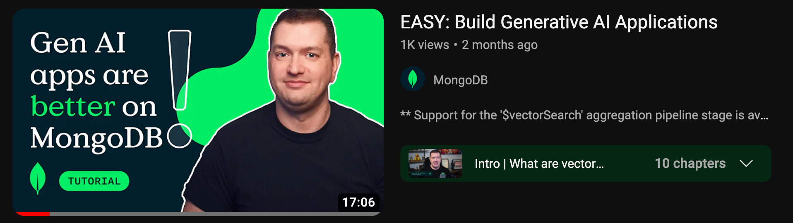
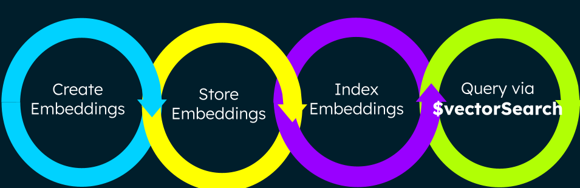
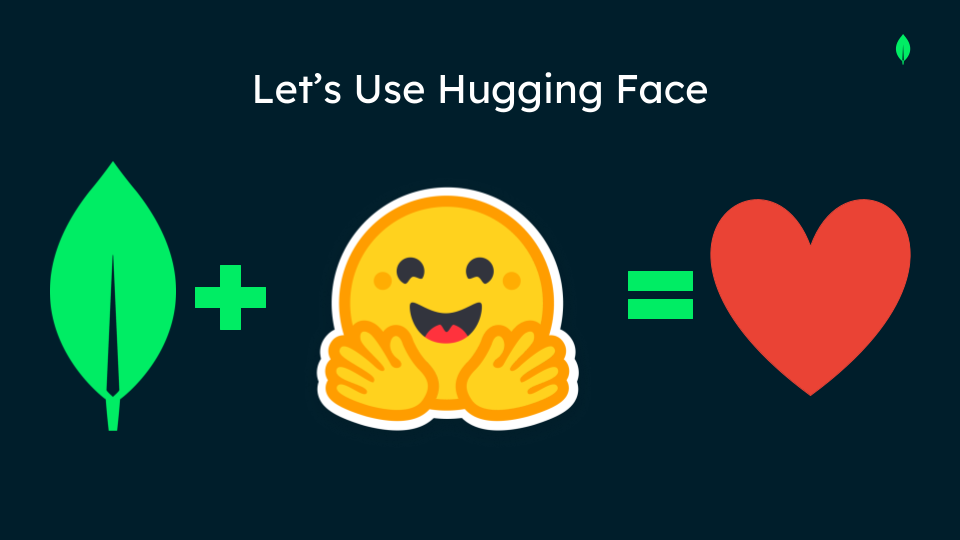
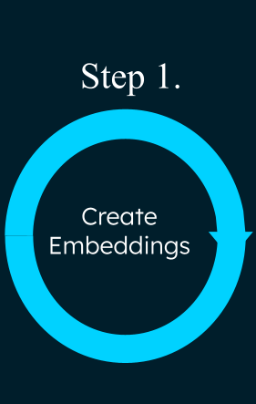
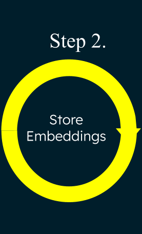
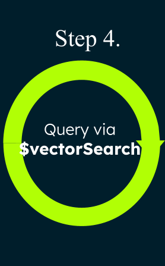

### MongoDB Atlas Vector Search Workshop

<h4 style="color:green">Looking to power an artificial intelligence with long term memory that could take over the world? Or maybe something simpler like retrieval augmented generation (RAG), semantic search, recommendation engines, or dynamic personalization. It all starts with the ability to search across the vector embeddings of your data.</h4>

<p>In this lesson, you will learn how to create vector embeddings to store inside MongoDB Atlas with machine learning models such as the ones provided by OpenAI and Hugging Face. Then you will see how easy it is to implement vector search across by using the <code>$vectorSearch</code> operator in the easy-to-learn, ever-extensible MongoDB aggregation framework you already know and love. "GREEN HEART" </p>
<p>
In just a few simple code functions, a sample movie dataset, and a free forever MongoDB Atlas cluster, you will semantically search for movies based on their plot. Semantic search means we search across data using <i>intent</i> and <i>contextual meaning</i> for more relevant results. For instance, you can search for <code>cop</code> instead of <code>police man</code> and find both (and then some). Compare this to <i>full-text search</i> which only allows you to find words by spelling, not the general meaning. You know what I mean. 😉

**This project is based on the fantastic YouTube tutorial by Jesse Hall. Click to open the link to the tutorial and code along with Jesse.**

<br/>
<div align="center">
<a href="https://www.youtube.com/embed/wOdZ1hEWvjU?si=Z69G9eKLFKC4LfUs"></a>
</div>

This workshop is broken down into 4 parts to teach you how to create and perform vector search on your MongoDB Atlas data.

<div align="center"></div>

- Create vector embeddings from the plots of movie documents using the encoding model <code>all-MiniLM-L6-v2</code> found on Hugging Face.
- Store those vector embeddings alongside your other data fields in your sample movie document.
- Index your movie documents using <code>knn</code>, the <code>cosine</code> similarity function, as well the dimensions of the <code>all-MiniLM-L6-v2</code> model.
- Query for your choice of movie using <code>$vectorSearch</code> aggregation operator!

<br/>
<h3>Prerequisites</h3>
<div align="center">
<a href="https://huggingface.co/"></a>
</div>
<div align="left" style="margin: 20px">This application was created using:

- Node.js
- Hugging Face sentence-transformers/all-MiniLM-L6-v2 model
- The Atlas sample dataset of sample_mflix.movies</div>
  As such, you will need the following:<br>
- A MongoDB Atlas account. Get one for free <a href="https://www.mongodb.com/cloud/atlas">here.</a> <hr>See how it is done: https://www.youtube.com/watch?v=jXgJyuBeb_o<hr>
- A recent version of Node.js and npm.<br>
- Atlas sample dataset<br>
- A <a href="https://huggingface.co/" >HuggingFace </a>access token.

<h2>Getting Set Up</h2>

1. Clone the repo.
2. Navigate inside directory <code>cd movie-vector-embedding-lab
   </code>
3. Run <code>npm install</code> .
4. Create a .env file in the root directory with the following environment variables:<br/>
   <code>MONGODB_CONNECTION_STRING=
   HF_ACCESS_TOKEN=
   OPENAI_KEY=</code>
5. Click the **Connect** button in the Atlas UI to find your MongoDB Atlas connection string for the Node.js driver in the Atlas UI. Replace your username and password before pasting into you <code>.env</code> file. It should look like this: <code>mongodb+srv://<username>:<password>@Cluster0.ecmzvfs.mongodb.net/?retryWrites=true&w=majority</code>
6. Replace your HuggingFace access token, as well. You can obtain an access token from the <a href="https://huggingface.co/" >HuggingFace </a>website by following the steps in the gif below:

<div align="center"><a href="https://huggingface.co/"></a>
</div>

Let's have a look at the **<code>main.js</code>** file. This is where we will execute the all the functionality needed for Atlas Vector Search in this workshop. Notice access to the environment variables on line 5: <br><code>const uri = process.env.MONGODB_CONNECTION_STRING;</code> and line 8 for your Hugging Face access token:<br><code>const hf_token = process.env.HF_ACCESS_TOKEN;</code><br>

<h2>Testing Atlas Cluster Connection</h2>
Let's make sure you have your **.env** file set up with your Atlas cluster connection string by executing the <code>main</code> file in the terminal. <br> Typing <code>node main</code> will execute the **main** function on <code>line 27</code>.<br><code>main().catch(console.dir);</code><br> In the <code>try</code> statement, the application will ping the client. If successful, the following message will appear in the console: <br><code>Pinged deployment. You successfully connected to your MongoDB Atlas cluster.</code>
<br> The app will finally close the connection to the Atlas cluster when finished: <br><code>Closing connection.</code>  <br>
If this is not working, make sure you have correctly whitelisted your IP address. If you are connecting successfully, we can start searching for vectors!

<h2 style="color:green">Let's Get Started!</h2>

If you got this far, then you have successfully connected to your Atlas cluster, and we can start creating vector embeddings. Go ahead and comment out <code>line 27. main().catch(console.dir);</code> in the <code>main.js</code> file since we no longer need to execute that functionality. <br></br>
All of the code for the following steps can be found in the **functionDefinitions.js** file.

|                                                                                                       |                                                                                                                                                                                                                                                                                                                                                                                                                                                                                                                                                                                                    |
| ----------------------------------------------------------------------------------------------------- | -------------------------------------------------------------------------------------------------------------------------------------------------------------------------------------------------------------------------------------------------------------------------------------------------------------------------------------------------------------------------------------------------------------------------------------------------------------------------------------------------------------------------------------------------------------------------------------------------- |
|  | <h4 style="color:indigo; margin-left:20px">Step 1: Create vector embeddings for movie plot.</h4> In the **functionDefinitions.js** file, the <code>generateEmbeddings</code> function is on lines 2 - 28. Copy this function and paste it into the your `main.js` file. <br> Notice that it makes a POST call to the HuggingFace hosted embedding url using your HuggingFace access token. If successful, the function will log the array of floats to the console. <h6>Test the **generateEmbeddings** functionality by executing <code>generateEmbeddings("MongoDB is AWESOME!!!");</code> </h6> |
|  | <h6 style="color:indigo; margin-left:20px">Step 2: Store newly acquired plot embeddings directly in your movie documents.</h6>                                                                                                                                                                                                                                                                                                                                                                                                                                                                     |
|  | <h6 style="color:indigo; margin-left:20px">Step 3: Create a vector index on the plot embedding field leveraging the Atlas UI.</h6>                                                                                                                                                                                                                                                                                                                                                                                                                                                                 |
|  | <h6 style="color:indigo; margin-left:20px">Step 4: Search semantically with the <code>$vectorSearch</code> aggregation operator.</h6>                                                                                                                                                                                                                                                                                                                                                                                                                                                              |

**No additional servers or software needed. No need to keep data in sync. Everything is done in MongoDB Atlas.**

If you have any questions or feedback about this repo, feel free to create an Issue or PR in this repo.

Also please join our online <a href="https://developer.mongodb.com/community/forums/">MongoDB Community</a> to interact with our product and engineering teams along with thousands of other MongoDB and Realm users. <br/><br/>Have fun and happy coding!

```

```
